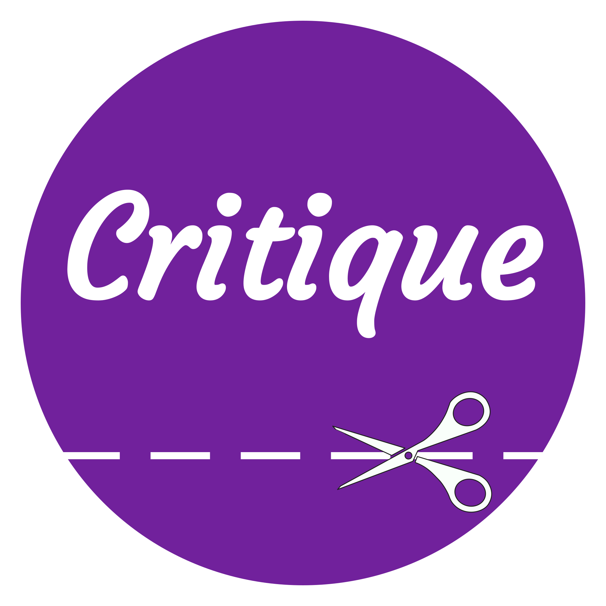

 
 

Critique is an application that helps you create critical CSS for your webpages, with the simplicity of a GUI.

The application is built on Electron, NodeJS and many other tools.

Critique is still in development, and thus prone to bugs and a lack of features. You can help by marking issues that you run into, making feature requests or even making pull requests!
